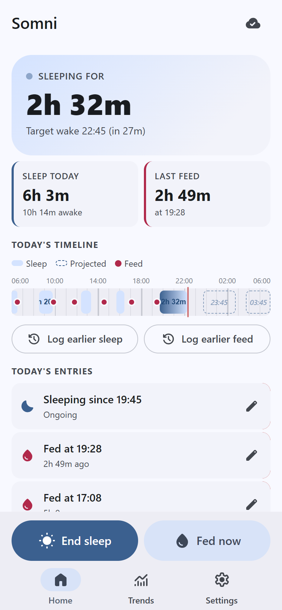
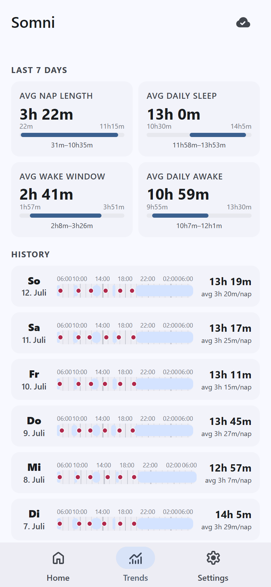
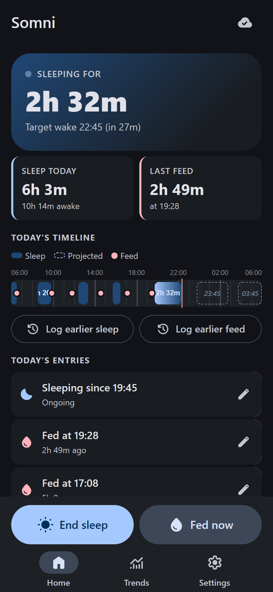

# Somni

A private, offline-first baby sleep & feeding tracker — built as an installable PWA, synced in realtime between the parents' phones.

Somni started life as a Claude artifact (a single self-contained HTML file) and grew into this standalone app. It is designed for **one household running its own instance**: you deploy it yourself, create exactly the accounts you need, and nobody else can ever see the data.

<p align="center">
  &nbsp;&nbsp;&nbsp;
  &nbsp;&nbsp;&nbsp;
  
</p>

## Features

- **24-hour timeline** of sleeps and feeds, live-updating
- **Sleep cycle projection** — estimates when the current nap will hit a wake-up window
- **One-tap logging**: start/stop sleep, log a feed, adjust times afterwards
- **Trends screen** with day-by-day stats and a heatmap of sleep patterns
- **Realtime sync**: log a feed on one phone, it appears on the other within a second
- **Offline-first**: works without a connection, queues writes, reconciles on reconnect
- **Installable PWA** with launcher shortcuts (long-press the icon to start a sleep or log a feed)
- **Material 3 design** with automatic light/dark mode
- **Import / export** of all data as JSON

## Private by design

This app is meant to be deployed once per household, not used as a shared service:

- **Signups are disabled** in Supabase — accounts are created manually in the dashboard, so only the people you add can ever log in.
- **Row Level Security** on every table only allows authenticated users; anonymous requests return nothing.
- Because of that, the Supabase **anon key is safe to ship** in the client bundle — it grants no data access on its own.
- All data lives in *your* Supabase project. There is no third-party service, tracking, or analytics.

A verification script ([scripts/verify-sync.mjs](scripts/verify-sync.mjs)) checks the deployed project against these expectations — see [Setup](#3-verify-the-deployment).

## Stack

| Layer | Choice | Why |
|---|---|---|
| UI | [Svelte 5](https://svelte.dev) + [m3-svelte](https://github.com/KTibow/m3-svelte) | Tiny bundle, compiled reactivity, Material 3 out of the box |
| Language | TypeScript | Types the sync-critical surface end-to-end (IDs, queue entries, conflict states) |
| Build | Vite + [vite-plugin-pwa](https://vite-pwa-org.netlify.app/) | Handles service worker & PWA cache versioning correctly |
| Backend | [Supabase](https://supabase.com) (Postgres + Auth + Realtime) | Zero ops, free tier is ample for a household, realtime push drives the sync |
| Hosting | Any static host (Vercel, Netlify, Cloudflare Pages, …) | The app is a pure static SPA |

## Setup

You need [Node.js](https://nodejs.org) 20.19+ (or 22.12+) and a free [Supabase](https://supabase.com) account.

### 1. Create the Supabase project

1. Create a new project at [supabase.com/dashboard](https://supabase.com/dashboard).
2. Open **SQL Editor → New query**, paste the contents of [supabase/schema.sql](supabase/schema.sql), and run it. This creates the tables, triggers, RLS policies, and realtime publication.
3. **Authentication → Sign In / Up** → disable **"Allow new users to sign up"**. This is the key privacy step: nobody can ever create an account.
4. **Authentication → Users → Add user** → create one account per person (email + password). Two for a typical household.

### 2. Run locally

```sh
git clone https://github.com/<you>/somni.git
cd somni
npm install
cp .env.example .env
```

Fill in `.env` from **Project Settings → API** in the Supabase dashboard:

```sh
VITE_SUPABASE_URL=https://your-project-ref.supabase.co
VITE_SUPABASE_ANON_KEY=your-anon-public-key
```

(The anon key is public by design — but **never** put the `service_role` key in `.env` or anywhere in the client.)

Then:

```sh
npm run dev
```

Log in with one of the accounts you created in step 1.

### 3. Verify the deployment

After the schema and dashboard steps, check that the project is actually locked down:

```sh
npm run verify:sync
```

This verifies that anonymous requests return zero rows (RLS), that signup attempts are rejected, and — if you provide test credentials — that login works and realtime changes round-trip between two connections:

```sh
SOMNI_TEST_EMAIL=you@example.com SOMNI_TEST_PASSWORD=... npm run verify:sync
```

## Deployment

`npm run build` produces a fully static site in `dist/` — any static host works. Two things to know:

- The `VITE_*` variables are **baked in at build time**, so they must be set in your host's build environment, not just locally.
- The service worker requires HTTPS, which every mainstream host provides by default.

No SPA rewrite/fallback rules are needed; the app runs entirely on one URL.

### Vercel

1. Push the repo to GitHub and [import it into Vercel](https://vercel.com/new). The **Vite** framework preset is auto-detected (build command `npm run build`, output directory `dist`).
2. Under **Settings → Environment Variables**, add `VITE_SUPABASE_URL` and `VITE_SUPABASE_ANON_KEY` with the values from your `.env`.
3. Deploy. Open the URL on each phone and use the browser's "Add to Home Screen" / install prompt to install it as an app.

## License

[MIT](LICENSE)
